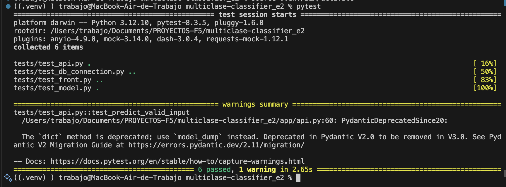

# Proyecto VII para FactoriaF5 : Problema de clasificación multiclase

<p align="center">
  
</p>


Este proyecto tiene como finalidad desarrollar un modelo de machine learning capaz de resolver un problema real utilizando algoritmos de clasificación multiclase.

Para ello hemos elegido el dataset **"diabetes_012_health_indicators_BRFSS2015.csv"** desde [Kaggle](https://www.kaggle.com/datasets/alexteboul/diabetes-health-indicators-dataset/data) .

Usaremos este dataset para determinar si una persona **está sana, tiene prediabetes o tiene diabetes**. Este modelo de machine learning, al que hemos llamado DIABETEST, está orientado a centros de salud que deseen realizar un análisis preventivo de sus pacientes, con el objetivo de identificar casos que requieran seguimiento médico temprano.

Para ello deberán rellenar de un formulario que consta de 23 preguntas y devuelve una de las siguientes opciones:
- "No presenta diabetes."
- "Prediabetes detectada. Se recomienda vigilancia médica."
- "¡Diabetes diagnosticada! Consulte a un especialista."

El proyecto consta de un backend realizado con FastApi y conectado a una base de datos en línea en Supabase que guarda cada solicitud, y un frontend con Dash.


### Para poner en marcha el proyecto usa los siguientes comandos:

Clona el repositorio en tu PC:
````
git clone https://github.com/Bootcamp-IA-P4/multiclase-classifier_e2.git
````
Entra al repositorio:
````
cd multiclase-classifier_e2
````
Crea tu entorno virtual en Mac:
````
python3 -m venv .venv
source .venv/bin/activate
````
Crea tu entorno virtual en Windows:
````
python -m venv .venv
.venv\Scripts\activate
````
Instala las dependencias:
````
pip install -r requirements.txt
````
Corre el backend en un nuevo terminal:
````
cd backend
uvicorn main:app --reload
````
Corre el frontend en un nuevo terminal:
````
python app/front.py
````
Ahora puedes entrar a las rutas correspondientes:
- http://127.0.0.1:8050/ : para frontend
- http://127.0.0.1:8000/ : para backend

### Test para el buen funcionamiento del programa

Tenemos 6 tests divididos en 4 archivos que comprueban que todos los pasos del programa funcionan correctamente.

- **test_api.py** : Verifica que la API responde correctamente y que los campos esperados están presentes. 
- **test_db_connection.py** : Verifica que las variables de entorno para Supabase están definidas y que se puede realizar una consulta exitosa a la tabla diabetes_predictions.
- **test_front.py** : Verifica que la función predict del frontend responde correctamente a entradas válidas y simuladas, mostrando una alerta con el resultado de la predicción (por ejemplo, “Diabetes”), tanto con datos reales como con una respuesta mockeada del backend.
- **test_model.py** : Verifica si el modelo se carga correctamente y predice una clase válida

### Para probar los tests sigue estos pasos:

Corre el backend:
````
cd app
uvicorn api:app --reload
````
Comando para probar los tests:
````
pytest
````



##  Futuras implementaciones

- Dar funcionalidad al botón "Ver historial" para mostrar las solicitudes anteriores.
- Dockerizar
- Renderizar
- Mejorar las métricas del modelo
- Reentrenar el modelo con los datos recopilados mediante el frontend
- Acceso mediante usuarios y login